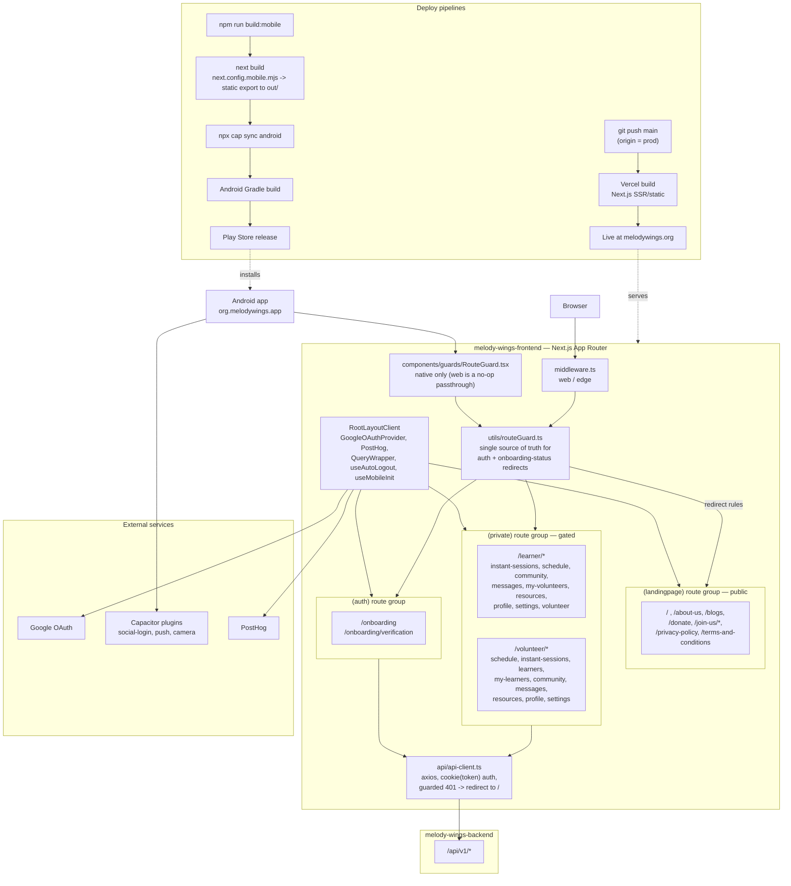

# melody-wings-frontend

Next.js (App Router) application for **Melody Wings** learners and volunteers. This is the end-user app for the platform — landing page, onboarding, session scheduling, community, chat, resources, and donations — and it also ships as a native Android app (`org.melodywings.app`) via Capacitor. It talks exclusively to [melody-wings-backend](../melody-wings-backend).

## Tech stack

| Layer | Technology |
|---|---|
| Framework | Next.js 14 (App Router), TypeScript |
| Data fetching / cache | `@tanstack/react-query` v5 |
| State | `zustand`, `nuqs` (URL state) |
| UI | `antd`, `@mui/material` + `@mui/x-date-pickers`, `framer-motion`, `@fullcalendar/*` |
| Forms | `react-hook-form` + `zod` |
| Auth | `@react-oauth/google` (web), `@capgo/capacitor-social-login` (native) — Google OAuth only, no password login |
| Native shell | Capacitor (camera, filesystem, push/local notifications, network, splash screen) |
| Analytics | PostHog |
| Deploy | Vercel (web), static export + Gradle (Android) |

## Architecture



**Routing/auth gating**: there is no dedicated `/login` page — sign-in is a modal (`LoginModal`/`SignUpAsModal`) triggered from the landing page. All redirect logic (unauthenticated → landing, incomplete onboarding → `/onboarding`, rejected/pending learners → `/onboarding/verification`, completed users away from landing/cross-role pages → their role's default route) lives in one framework-agnostic module, `src/utils/routeGuard.ts`, consumed by both `middleware.ts` (web) and `RouteGuard.tsx` (native, since a static-exported Capacitor build has no Next middleware). This consolidation replaced two previously hand-synced, drifted implementations.

## End-to-end flow

The full sign-in → onboarding → routing decision path, covering both the web (middleware-driven) and native (client-side `RouteGuard`) cases:

```mermaid
sequenceDiagram
    autonumber
    participant U as User
    participant Gate as middleware.ts / RouteGuard.tsx
    participant RG as utils/routeGuard.ts
    participant Modal as LoginModal / SignUpAsModal
    participant GO as Google OAuth
    participant API as api-client.ts
    participant BE as melody-wings-backend

    U->>Gate: request any route
    Gate->>RG: getRedirectForRoute(pathname, auth state)
    RG-->>Gate: no token -&gt; only landing routes allowed
    Gate-->>U: render landing page

    U->>Modal: click Sign in / Sign up
    Modal->>GO: useGoogleLogin() (web) / native social-login (Android)
    GO-->>Modal: OAuth access token
    Modal->>API: apiGoogleLogin(access_token)
    API->>BE: POST /api/v1/auth (Google token)
    BE-->>API: JWT + onboarded_status
    API-->>Modal: set token / role / onboarded_status cookies

    U->>Gate: next navigation
    Gate->>RG: getRedirectForRoute(pathname, {token, role, onboarded_status})
    alt onboarded_status = details_pending / partially_filled
        RG-->>U: redirect to /onboarding
    else onboarded_status = verification_pending / rejected (learner)
        RG-->>U: redirect to /onboarding/verification
    else onboarded_status = verification_completed
        RG-->>U: redirect to role default (/learner/instant-sessions or /volunteer/schedule)
    end

    U->>API: authenticated data calls from private pages
    API->>BE: GET/POST /api/v1/* with Bearer token
    BE-->>API: 401 on expired/invalid token
    API-->>U: clear cookies, redirect to / (guarded against loops)
```

## Directory structure

```
src/app/
  layout.tsx, RootLayoutClient.tsx     # root shell: providers, route guard, auto-logout
  page.tsx                             # "/" landing page
  (landingpage)/                        # public marketing routes
  (auth)/onboarding/                    # onboarding form + verification polling
  (private)/
    learner/                            # instant-sessions, schedule, community, messages, ...
    volunteer/                          # schedule, instant-sessions, learners, community, ...

src/api/                # axios client + per-domain API functions (auth, chat, sessions, ...)
src/components/         # organized by domain: schedule, community, messages, learners/volunteers,
                        # profile, resources, onboarding, guards, common (Button/Input/Toast/...)
src/utils/              # routeGuard.ts (shared auth gating), auth.ts (cookies), timeFunctions.ts
                        # (timezone/slot conversion for availability scheduling), platform.ts
src/services/           # native-auth.ts (native Google sign-in)
src/providers/          # QueryWrapper (the one real QueryClient), theme, etc.

android/                # native Android project (Gradle), appId org.melodywings.app
capacitor.config.ts     # webDir "out", CapacitorHttp enabled, native plugin config
next.config.mobile.mjs  # static-export config swapped in only for mobile builds
```

## Auth

Google OAuth only, no password path. Web uses `useGoogleLogin` from `@react-oauth/google` (`GoogleOAuthProvider` mounted in the root layout); native uses `nativeGoogleSignIn()` via the Capacitor social-login plugin. Both resolve to `apiGoogleLogin(access_token)`, and the returned `onboarded_status` drives where `routeGuard.ts` sends the user next.

## Running locally

```bash
npm install
npm run dev       # http://localhost:3000
```

Set `NEXT_PUBLIC_API_URL` (defaults to `http://localhost:8002`) to point at a running [melody-wings-backend](../melody-wings-backend), plus `NEXT_PUBLIC_GOOGLE_CLIENT_ID` for OAuth.

### Mobile (Android) build

```bash
npm run build:mobile   # swaps in next.config.mobile.mjs, static-exports to out/, restores web config
npx cap sync android
npx cap open android    # or: npm run mobile:run / mobile:live for live reload
```

Native builds hit the hardcoded production API (`https://api.melodywings.org/api/v1`) rather than the web env var.

## Known gaps

- `src/api/query-client.ts` exports an unused, disconnected `QueryClient` instance — no current imports found; safe cleanup candidate (the real client lives in `src/providers/QueryWrapper`).
- Several modals (community, some schedule dialogs) are still statically imported rather than lazy-loaded, shipping their dependencies (e.g. `react-slick`, `@mui/x-date-pickers`) on every visit to those pages even if unopened.
- Two competing Next configs (`next.config.js`/`next.config.mjs`) exist outside the mobile-swap mechanism — worth consolidating.

See `PERFORMANCE-AUDIT-REPORT.md` and `AUDIT-REPORT.md` in the workspace root for the fuller audit history.
